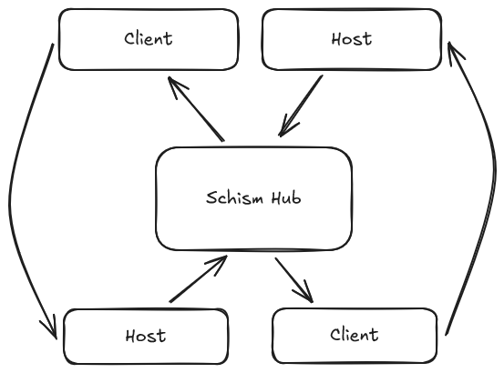

# Schism

> [!NOTE]
> This repo and readme is in its early stages and not ready to be consumed

//TODO

- [ ] Add workflow for Hub image push to repository
- [ ] Add workflow for building nuget packages
- [ ] Add docker/nuget instructions to readme
- [x] Split readme into lib specifics
- [ ] Contribution?

## Summary

**Schism** is dotnet library intended to unify the communication between different services with simple and generic patterns.

> **schism** _noun_ /ˈs(k)izəm/ : a split or division between strongly opposed sections or parties, caused by differences in opinion or belief.

## Concepts

With the large variety of choices for communication these days, Schism aims to abstract communication in such a way that all a consumer needs to know when accessing an endpoint is the contract for the endpoint itself. All the details about the endpoint such as if its a POST request over HTTP, or an Azure Service Bus message - those are left to the server to decide. 

How this works is by standing up a locator service we've called **The Hub** - host applications register their properties with the Hub, and the client applications periodically check in with the Hub to understand the hosts it wishes to talk to.

<picture>
  <source media="(prefers-color-scheme: dark)" srcset="./assets/schism-hub-diag2-dark.png">
  
</picture>

As you can see in the crude diagram above, the hosts register with the hub, the clients take that information and then make direct requests to the hosts.

This has some benefits:
* Clients don't need to know anything about _how_ to connect to a host - the Hub tells them that information
* Hosts can advertise information about their API's like version, endpoints etc. giving clients more flexibility in how they communicate depending on your circumstances

Given the above system, we can use language tooling to further simplify the communication between services. Given a shared interface, a client can make a request like so:
```csharp
//client application
private readonly ISchismClientFactory _factory;
public async Task Add(int a, int b)
{                                        //shared interface
    var hostClient = _factory.GetClientFor<IMathContract>();
    var result = await hostClient.Add(new AdditionRequest(a, b));
    Console.WriteLine(result.Data);
}
```
The details of how that request is made are completely abstracted from the implementation. All the client cares about is printing the result of `a + b`, not which protocol it used to get there.

## Getting Started

### The Hub

You can spin up the Hub locally, or host it in the cloud:
```docker
TODO: docker run
```
The Hub will also require a database, currently only PostgreSql is supported. The database will need migrations applied to it
```
TODO: apply migrations
```

### Configuration

Your applications will need to reference the Core library
```
//TODO: add package
```

And you'll also need supporting libraries depending on your needs

Library|Docs
-|-
Schism.Lib.Http|[docs](./Schism.Lib.Http)
Schism.Lib.ServiceBus|[docs](./Schism.Lib.ServiceBus)

In your `appsettings.json` you'll need to add some variables:
```json
{
  "Schism": {
    //The URI pointing to the Hub
    "HubUri": "http://host.docker.internal:30100",
    //The URI that targets this application
    //Client-only applications do not require this to be defined
    "Host": "http://host.docker.internal:30300",
    //Optional: defaults to 300, the amount in 
    //seconds that the client will cache its hub response
    "Refresh": 300
  }
}
```

In your Startup/Program.cs you'll need to add the `SchismBuilder` and build your application:
```csharp
builder.Services
    .AddSchism(typeof(Program).Assembly, builder.Configuration)
    //Add client/host setup here
    .Build();
```

The rest of the the setup will be dependent on whichever Schism libraries you use.

### Client Usage

As a client, you will have access to the `ISchismClientFactory` from your DI container, from there you can chose from a few different implementations to send a request. You don't have to commit to one implementation, and can mix and match as you please.

> [!NOTE]
> The following examples assume the HTTP library is being used

<details open>
<summary>Auto-mapped Concrete Classes</summary>
    
#### Auto-mapped Concrete Contracts
With contracts you can interact with your host using strongly typed interfaces and very little boilerplate. The downside to this method is it tightly couples this library with your code on both the host and the client.

In your shared host/client library create a contract interface:

```csharp
//The ClientId property should describe the ClientId of the host
//application. The default value when creating a host is the
//assembly name.
[SchismContract(ClientId = "Example.WebApp")]
public interface IMyController : ISchismContract
{
    Task<AddResponse> Add(AddRequest request);
}
public record AddRequest(int A, int B);
public record AddResponse
{
    [JsonPropertyName("result")]
    public int Result {get;set;}
}
```

In your host application called `Example.WebApp`, your controller could look like this:

```csharp

[ApiController]
[Route("[controller]/[action]")]
public class MyController : ControllerBase, IMyController
{
    [HttpGet]
    public Task<AddResponse> Add([FromQuery] AddRequest request)
    {
        return Task.FromResult(new AddResponse()
        {
            Result = request.A + request.B
        });
    }
}
```

Now from our client application we can access our host like this:

```csharp
//...
private readonly ISchismClientFactory _factory;
public async Task DoMath(int a, int b)
{
    IMyController client = _factory.GetClientFor<IMyController>();
    AddResponse result = await client.Add(new AddRequest(a, b));
    Console.WriteLine($"{a} + {b} = {result.Result}");
}
//await DoMath(12, 8);
//prints: 12 + 8 = 20
//...
```

</details>

<details>
<summary>Blind Concrete Contract</summary>

#### Blind Concrete Contracts

Concrete contracts don't require being implemented on the host! This has the downside of potential for breaking changes being implemented since you lose the strong typing of your contract implementations.

In your shared library create a contract interface:

```csharp
//The ClientId property should describe the ClientId of the host
//application. The default value when creating a host is the
//assembly name.

//The Type property should describe the name of the controller
//this interface is a contract for
[SchismContract(ClientId = "Example.WebApp", Type = "MyController")]
public interface IMyController : ISchismContract
{
    Task<AddResponse> Add(AddRequest request);
}
public record AddRequest(int A, int B);
public record AddResponse
{
    [JsonPropertyName("result")]
    public int Result {get;set;}
}
```

In your host application called `Example.WebApp`, your controller would look like this:

```csharp

[ApiController]
[Route("[controller]/[action]")]
public class MyController : ControllerBase
{
    [HttpGet]
    public Task<AddResponse> Add([FromQuery] AddRequest request)
    {
        return Task.FromResult(new AddResponse()
        {
            Result = request.A + request.B
        });
    }
}
```

Now from our client application we can access our host like this:

```csharp
//...
private readonly ISchismClientFactory _factory;
public async Task DoMath(int a, int b)
{
    IMyController client = _factory.GetClientFor<IMyController>();
    AddResponse result = await client.Add(new AddRequest(a, b));
    Console.WriteLine($"{a} + {b} = {result.Result}");
}
//await DoMath(12, 8);
//prints: 12 + 8 = 20
//...
```

</details>
<details>
<summary>Flexible string-based requests</summary>

#### Flexible string-based requests

In case you want nothing to do with concrete contracts, you can create your requests simply by string locators. The downside to this method is its more verbose and relies on strings. The following example uses the above controller as an example

```csharp
//...
private readonly ISchismClientFactory _factory;
public async Task DoMath(int a, int b)
{
    ISchismClient client = _factory.GetClient("Example.WebApp"); //default client is assembly name
    SchismRequest request = client
        .GetRequest("MyController.Add") //default connection point is <Class>.<Method>
        .WithBody(new AddRequest(a, b));
    SchismResponse result = await client.SendRequestAsync(request);
    AddResponse response = await result.ContentAsJsonAsync<AddResponse>();
    Console.WriteLine($"{a} + {b} = {response.Result}");
}
//await DoMath(12, 8);
//prints: 12 + 8 = 20
//...
```

</details>

## Future Plans

- [ ] Performance improvements
- [ ] More client/host support such as gRPC, MQTT, AMQP, Kafka
- [ ] Better documentation
- [ ] Support for other languages
- [ ] More control over the concrete contract requests ad-hoc
- [ ] Ability to glean information about the host such as version, status, etc.